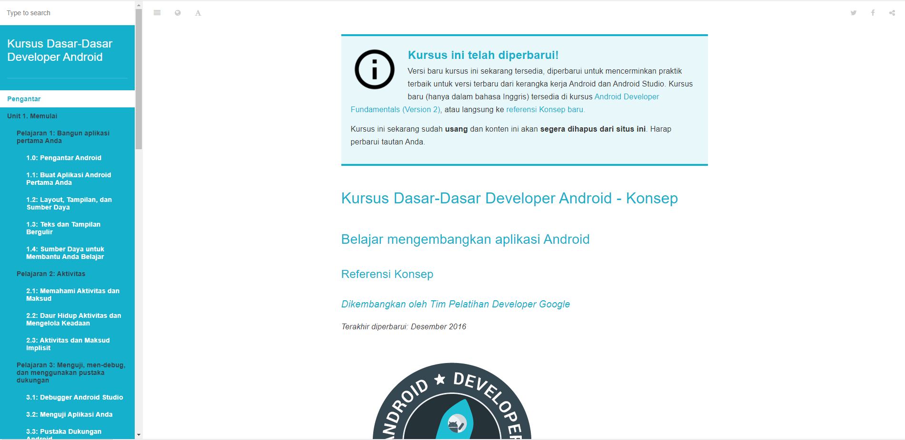
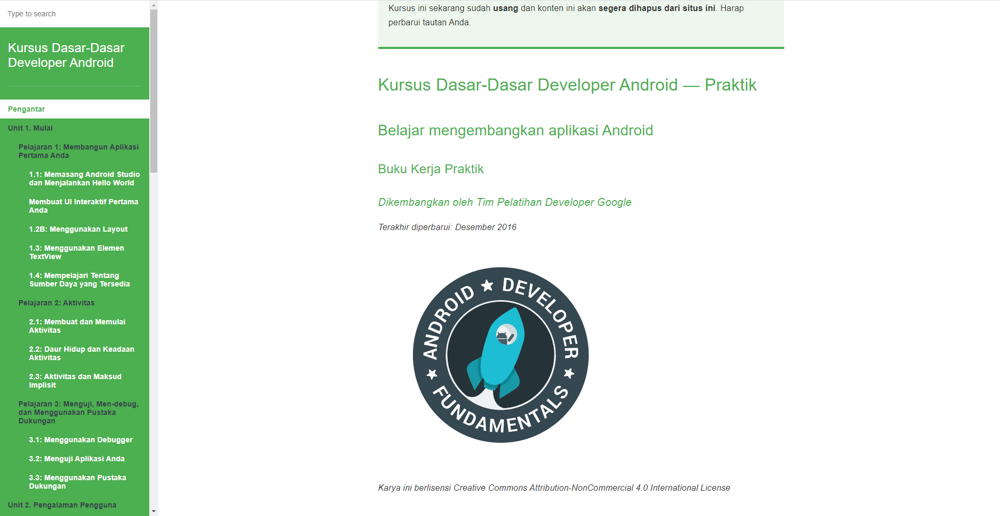
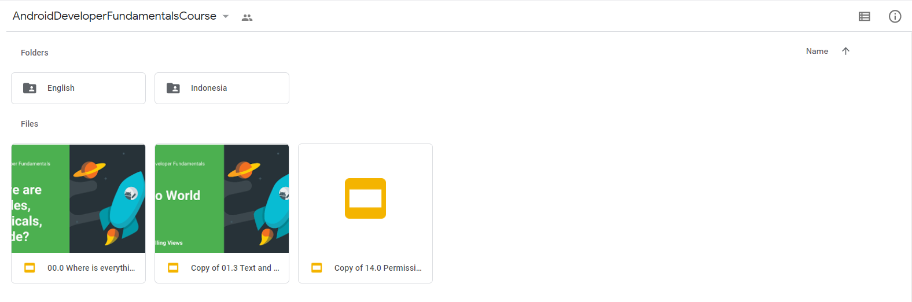

**Android** adalah salah satu OS (Operating System) yang dijalankan di banyak device, mungkin termasuk smartphone atau tablet yang kamu gunakan sekarang, wajar saya peluang untuk membuat aplikasi berbasis android sangat menarik untuk programmer /developer seperti saya dan kamu! Bayangkan bisnis atau produk kamu bisa diinstall dengan mudah oleh pengguna kamu nantinya melalui playstore

Untuk mulai membuat aplikasi android kita bisa memilih menggunakan bahasa program java atau kotlin, saya pribadi lebih cenderung menggunakan bahasa modern yang lebih nyaman untuk kita nanti yaitu kotlin. Kalau kamu belum mulai.

Setelah itu silahkan lanjutkan dengan mengikuti tahapan yang sudah kami buat di bawah. Jangan khawatir kita akan memulai belajar aplikasi android ini benar-benar dari awal alias dari nol, jangan khawatir kalau kamu adalah seorang pemula, tutorialnya akan kita bikin sederhana dan asyik untuk kamu ikuti. Tutorial ini juga terbuka kalau kamu punya latar belakang web developer seperti saya.

### Modul Teori Pemrograman Android

Modul ini berisi konsep dan teori dasar pemrograman android. Cocok digunakan untuk kuliah teori.

**Download:** [PDF](https://www.gitbook.com/download/pdf/book/google-developer-training/android-developer-fundamentals-course-concepts?lang=idn)✔️ | [ePub](https://www.gitbook.com/download/epub/book/google-developer-training/android-developer-fundamentals-course-concepts?lang=idn)✔️ | [Mobi](https://www.gitbook.com/download/mobi/book/google-developer-training/android-developer-fundamentals-course-concepts?lang=idn)✔️ | [📖 Baca online](https://google-developer-training.github.io/android-developer-fundamentals-course-concepts/idn/)✔️

**Apa saja yang akan dipelajari?**

 * Unit 1. Pengenalan Dasar Pemrograman Android
 * Unit 2. Merancang UI/UX
 * Unit 3. Background Task
 * Unit 4. Menggunakan Database
 * Unit 5. Penutup

 ### Modul Praktikum Pemrograman Android

 Modul ini berisi praktek pemrograman android, dilengkapi dengan tugas yang harus dikerjakan. Bisa digunakan untuk kuliah praktikum.

 

**Download:** [PDF](https://www.gitbook.com/download/pdf/book/google-developer-training/android-developer-fundamentals-course-practicals?lang=idn)✔️ | [ePub](https://www.gitbook.com/download/epub/book/google-developer-training/android-developer-fundamentals-course-practicals?lang=idn)✔️ | [Mobi](https://www.gitbook.com/download/mobi/book/google-developer-training/android-developer-fundamentals-course-practicals?lang=idn)✔️ | [📖 Baca online](https://google-developer-training.github.io/android-developer-fundamentals-course-practicals/idn/index.html)✔️

**Apa saja yang akan dipelajari?**

 * Unit 1. Pengenalan Dasar Pemrograman Android
 * Unit 2. Merancang UI/UX
 * Unit 3. Background Task
 * Unit 4. Menggunakan Database
 * Tugas

 ### Video Tutorial Pemrograman Android

 Buat kamu yang kesulitan belajar dari buku, Google sudah menyediakan video tutorial dan kursus di Udacity.

 #### Video tutorial pemrograman android resmi dari Google:

 <figure class="video_container">
  <iframe src="https://www.youtube.com/embed/yaZ66V0mKSM" frameborder="0" width-min="750rem" height-min="400rem" allowfullscreen="true"> </iframe>
</figure>

 ### Slide Presentasi Pemrograman Android dan Silabus

 Selain modul dan video, Google juga menyediakan slide presentasi dan silabus (rencana pengajaran) untuk pengajar, guru, dosen, instruktor, tutor.

  

 Silahkan download di: [ ⬇️ Google Drive✔️](https://drive.google.com/drive/u/0/folders/0B5Kg0X0yIQ1Pbk5yVGdsSFFjR28?hl=id)

### Modul Android untuk Tingkat Mahir

  

  Buat kamu yang sudah menguasai bahasa pemrograman Java dan memiliki beberapa pengalaman mengembangkan aplikasi android, ini adalah modul untukmu.

  **Download:** [PDF](https://google-developer-training.github.io/android-developer-advanced-course-concepts/android-developer-advanced-course-concepts.pdf)✔️ | [📖 Baca online](https://google-developer-training.github.io/android-developer-advanced-course-concepts/)✔️ | [Slide Presentasi ✔️](https://drive.google.com/drive/folders/1MRqvBGEDtNtpDyKd8sulMJreFCz1JxgC) | [Course✔️](https://codelabs.developers.google.com/advanced-android-training/) | [Source Code✔️](https://github.com/google-developer-training/android-advanced)

Pada modul tingkat lanjut ini, akan dibahas beberapa topik, seperti:

 * Peningkatan UI
 * Sensor
 * Performa
 * Localization (untuk aplikasi multibahasa)
 * Accessibility
 * Geo Location
 * Place
 * Mapping
 * Custom Views
 * Canvas
 * Animasi
 * dll.

src : petanikode
